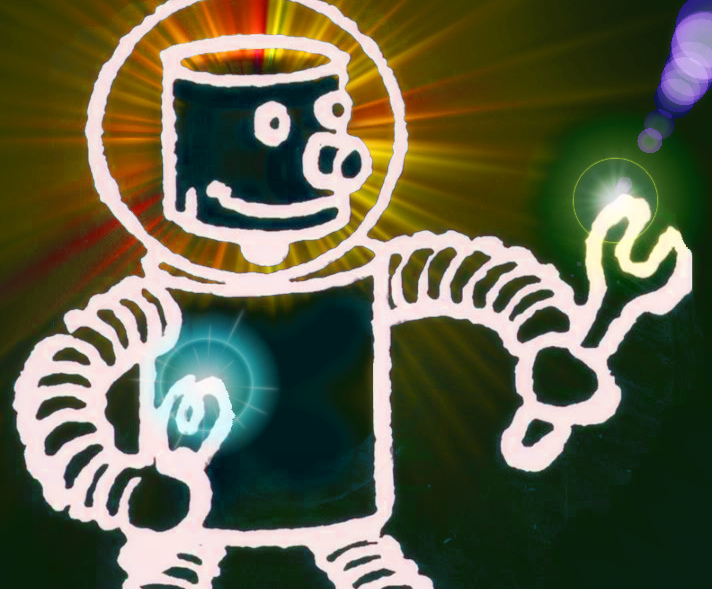

JuRLs
=====
**Java User's Reinforcement Learning System** (more human than human)

The name was inspired by HUGS (Haskell User's Gopher System)

Conclusions
-----

1. The success of the agent depend on numerical issues. I.e. if one divides the
reward by 10 or 100, then the agent might fail.
Coding in an unefficient style, might make the agent succeed.

2. With the results from conclusion no. 3, the conclusion no. 1 can be discarded.

3. To have success with control including function approximation,
the input values **must** be normalized within a certain range.
The range **must not** be predifined, but **must** be detected during the experiment.
This was the only way to make it work.
